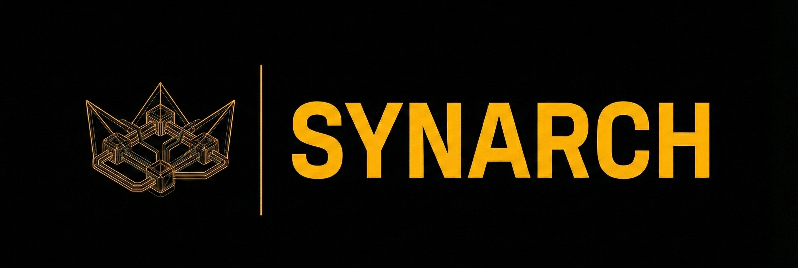
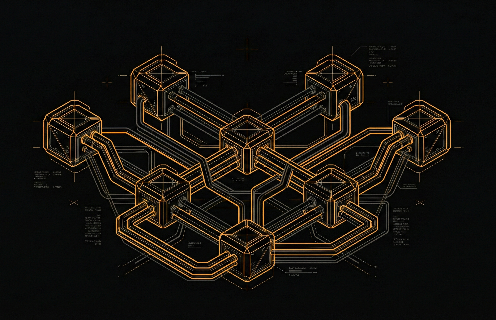
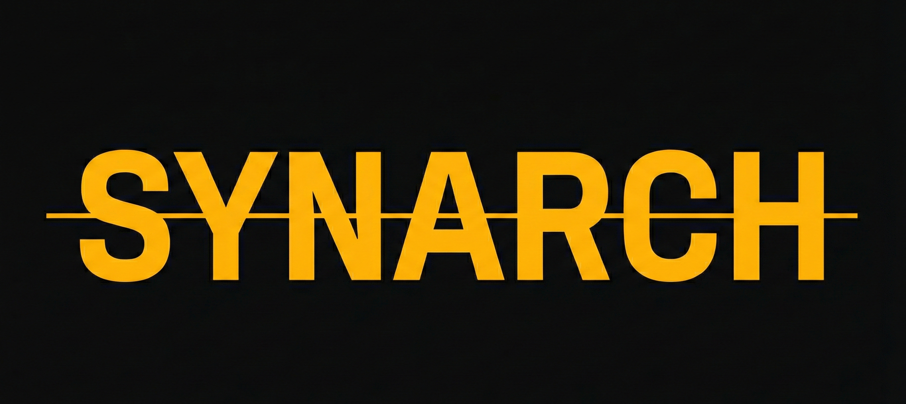

<div align="center">



### The Autonomous Multi-Agent Orchestration Engine

[](https://github.com/synarch-ai/synarch-engine)
[](LICENSE)
[](https://python.org)
[](https://typescriptlang.org)

<br/>

[Documentation](#documentation) · [Architecture](#architecture) · [Quick Start](#quick-start) · [The Council](#the-council) · [Roadmap](#roadmap)

<br/>

---

*"Where agents rule together."*

---

</div>

<br/>

## What is Synarch?

**Synarch** is an open-source, production-grade **operating system for autonomous AI agent teams.** Not another chatbot. Not another wrapper. An orchestration engine where specialized AI agents — each with a defined identity, role, and authority — collaborate in real-time to execute complex missions.

> **syn·arch** `/ˈsɪn.ɑːrk/` — *from Greek "syn" (together) + "arch" (to rule/govern)*
> Joint rule. Distributed sovereignty. Orchestrated intelligence.

<br/>

<div align="center">

| | Traditional AI | Agent Frameworks | **Synarch Engine** |
|---|---|---|---|
| **Agents** | 1 (chat) | Flat peers | **Hierarchical council** (God → CEO → C-Suite → Specialists) |
| **Communication** | Request/Response | Sequential chains | **Event-driven nervous system** (NATS) |
| **Identity** | System prompt | Role string | **Soul files** — personality, constraints, behaviors, authority |
| **Observability** | Logs | Print statements | **Mission Control dashboard** — real-time agent topology |
| **Recovery** | None | None | **PostgreSQL checkpoints** — resume from any state |
| **Cost** | One model fits all | One model fits all | **Smart routing** — Opus for strategy, Haiku for reviews, Ollama for free |

</div>

<br/>

## Architecture

```
                    ┌─────────────┐
                    │     GOD     │  ← You (The Human)
                    │   (Human)   │
                    └──────┬──────┘
                           │ Mission Control UI
                           ▼
                    ┌─────────────┐
                    │   SYNARCH   │  ← CEO Agent (Orchestrator)
                    │   Engine    │     Decomposes goals, delegates
                    └──────┬──────┘
                           │
            ┌──────────────┼──────────────┐
            │              │              │
       ┌────┴────┐   ┌────┴────┐   ┌────┴────┐
       │  ZEUS   │   │  THOTH  │   │  JANUS  │
       │  (CTO)  │   │  (CRO)  │   │  (QA)   │
       └────┬────┘   └────┬────┘   └─────────┘
            │              │
     ┌──────┴──┐    ┌──────┴──┐
     │HEPHAEST.│    │ HERMES  │
     │(Engineer)│    │(Research)│
     └─────────┘    └─────────┘
```

<br/>

## The Council

<div align="center">

Every agent has a **soul** — a markdown file defining their identity, personality, behaviors, and constraints. The mythology is intentional: it makes agent behavior memorable and debuggable.

</div>

| Agent | Title | Role | Model | Mythology |
|:---:|---|---|---|---|
| 🏛️ **Synarch** | CEO | Supreme Orchestrator | Claude Opus 4 | *The temple that houses all gods* |
| ⚡ **Zeus** | CTO | Engineering Commander | Claude Sonnet 4 | *King of Olympus — lightning-fast decisions* |
| 📜 **Thoth** | CRO | Knowledge Keeper | Claude Sonnet 4 | *Egyptian god of wisdom and writing* |
| 🪶 **Hermes** | Researcher | Information Gatherer | Llama 3.1 (local) | *Messenger god — fastest of all* |
| 🔨 **Hephaestus** | Engineer | Code Builder | Claude Sonnet 4 | *God of the forge — master craftsman* |
| 🎭 **Janus** | QA | Quality Reviewer | Claude Haiku 3.5 | *Two-faced god of transitions* |

<br/>

## Tech Stack

<div align="center">

| Layer | Technology | Why |
|---|---|---|
| 🧠 Orchestration | **LangGraph** | State machines with checkpointing + human-in-the-loop |
| ⚡ Nervous System | **NATS + JetStream** | Event-driven pub/sub, 60ns latency, subject hierarchy |
| 🤖 Model Routing | **litellm** | One interface for Bedrock, Ollama, OpenAI, 100+ providers |
| 🔍 Memory | **Qdrant** | Vector search with multi-tenancy (per-agent namespaces) |
| 🗄️ State | **PostgreSQL 16** | LangGraph checkpointing, structured mission state |
| 🖥️ Dashboard | **Next.js 14 + shadcn/ui** | Real-time Mission Control with SSE streaming |
| 🏠 Local LLM | **Ollama** | Free local inference for simple tasks |
| 🌐 API | **FastAPI** | Async, SSE support, OpenAPI auto-docs |

</div>

<br/>

## Quick Start

```bash
# Clone
git clone https://github.com/synarch-ai/synarch-engine.git
cd synarch-engine

# Start infrastructure
docker compose -f infra/docker-compose.yml up -d

# Start backend
cd backend
pip install -r requirements.txt
python main.py

# Start Mission Control
cd apps/web
npm install && npm run dev
```

Open **http://localhost:3000** — Mission Control awaits your orders.

<br/>

## Documentation

| Document | Description |
|---|---|
| [**PoC PRD**](docs/01-requirements/poc-prd.md) | Full product requirements — success criteria, API design, implementation phases |
| [**ADR-001: Swarms vs LangGraph**](docs/02-architecture/adr-001-swarms-vs-langgraph.md) | Why we chose LangGraph over Swarms (both agents agreed) |
| [**ADR-002: Branding Consolidation**](docs/02-architecture/adr-002-branding-synarch-ai-to-synarch.md) | Synarch AI → Synarch — canonical naming model for brand, product, and agent layers |
| [**ADR-003: Reference Repo Strategy**](docs/02-architecture/adr-003-reference-repo-strategy.md) | What we keep as reference, when we fork, and how we update `references/*` |
| [**ADR-004: Gap Closure + Adoption Contract**](docs/02-architecture/adr-004-gap-closure-and-reference-adoption-contract.md) | Binding plan to close architecture/runtime/UI gaps and govern reference adoption |
| [**Adoption Enforcement Playbook**](docs/02-architecture/adoption-enforcement-playbook.md) | PR-level governance gates, evidence requirements, and merge criteria for architecture/UI/runtime work |
| [**Reference Adoption Matrix**](docs/02-architecture/reference-adoption-matrix.md) | Living tracker for which patterns from `references/*` are planned/in-progress/adopted |
| [**Gap Closure Implementation Plan (2026-02-19)**](docs/plans/2026-02-19-gap-closure-and-reference-adoption.md) | Sequenced execution plan to move from PoC stubs to production-grade baseline |
| [**Mission Control UI/UX Strategy**](docs/03-product/mission-control-ui-ux-and-functionality-strategy.md) | Reference-backed product plan for cockpit UX, HITL controls, and operator trust surfaces |
| [**Agent Naming Convention**](docs/02-architecture/agent-naming-convention.md) | 20+ mythology-based agent names across 6 domains |
| [**Brand Identity (V3)**](branding/brand-identity.md) | Design system: Cyber-Sovereign Industrialism |
| [**Vision Analysis**](docs/02-architecture/synarch-vision-analysis-cline.md) | Competition landscape, architectural innovations |

### Agent Souls

| Soul | Identity |
|---|---|
| [🌟 God](docs/agents/god/soul.md) | The Human Creator — source of all authority |
| [🏛️ Synarch](docs/agents/synarch/soul.md) | Supreme Orchestrator — CEO of the agent council |
| [⚡ Zeus](docs/agents/zeus/soul.md) | CTO — Commander of Engineering |
| [📜 Thoth](docs/agents/thoth/soul.md) | CRO — Keeper of All Knowledge |
| [🪶 Hermes](docs/agents/hermes/soul.md) | Senior Researcher — The Fastest God |
| [🔨 Hephaestus](docs/agents/hephaestus/soul.md) | Senior Engineer — God of the Forge |
| [🎭 Janus](docs/agents/janus/soul.md) | Quality Architect — The Two-Faced Gate |

<br/>

## Design System

<div align="center">



**Aesthetic:** Cyber-Sovereign Industrialism

</div>

```css
/* The Synarch Palette */
--signal-amber:    #FFB900;  /* Brand accent — warning indicator energy */
--bg-void:         #0A0A0B;  /* Deep void — primary background */
--bg-plate:        #121214;  /* Component surface */
--border-primary:  #27272A;  /* Structure — everything has a border */
--signal-white:    #FAFAFA;  /* Information — crisp readouts */
```

Fonts: **Space Grotesk** (display) · **Geist Sans** (UI) · **JetBrains Mono** (logs)

<br/>

## Roadmap

- [x] **M0: Research & Architecture** — 50 SAMAS notes, 7 soul files, PRD, ADRs, brand system
- [ ] **M1: Foundation** — Docker, FastAPI, LangGraph StateGraph, Next.js skeleton
- [ ] **M2: The Brain** — Synarch→Zeus/Thoth delegation, soul→prompt compiler
- [ ] **M3: Specialists** — Hermes (research), Hephaestus (code), Janus (review)
- [ ] **M4: Nervous System** — NATS pub/sub, SSE streaming to dashboard
- [ ] **M5: Mission Control** — Real-time dashboard with agent topology
- [ ] **M6: Integration** — End-to-end mission flow, recovery, polish

<br/>

## Security Model

Synarch implements the **Rule of Two** (Meta Research, 2025):

> An agent session cannot simultaneously possess more than two of three critical risk properties without human approval:
> 1. Access to Private Data
> 2. Exposure to Untrusted Content  
> 3. External Communication

Violation triggers mandatory escalation through Synarch → God.

<br/>

## Contributing

Synarch is in early development. We're building in public. Watch the repo for updates.

<br/>

<div align="center">

---



**Synarch Intelligence** · [synarch.ai](https://synarch.ai) · [synarch.dev](https://synarch.dev)

*The crown is not worn by one. It is formed by many.*

<br/>

[](https://github.com/synarch-ai)

</div>
