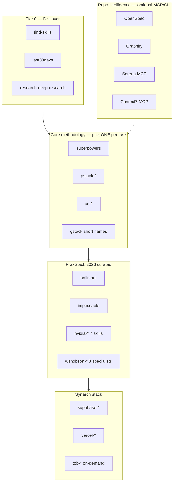
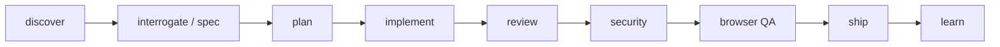

# Agent Skills & Plugin Ecosystem (PraxStack 2026)

Curated map of credible skill/plugin systems for pro developer workflows in
Cursor, Claude Code, Codex, and other agents. Synarch installs the **Installed
in this repo** set via `scripts/cloud-agent/install-pro-skills.sh`.

Design principle: **capability graph, not prompt landfill** — prefix on-demand
skills (`tob-`, `ce-`, `nvidia-`, `wshobson-`), short names for gstack only, and
document-only for broad repos that cause context rot.

## PraxStack 2026 architecture



## Layered pipeline

Use one layer at a time per task — do not stack competing methodologies
(superpowers + pstack + compound-engineering on the same feature causes context
rot and conflicting instructions).



| Stage | Installed skills | When |
|-------|------------------|------|
| **discover** | `find-skills`, `last30days` | Search skills.sh or recent trend research before inventing workflows |
| **interrogate / spec** | `brainstorming`, `ce-brainstorm`, `research-deep-research`, `gh-copilot-breakdown-feature-prd` | Clarify requirements, deep research, write specs |
| **plan** | `writing-plans`, `ce-plan`, `mp-triage`, `pstack-poteto-mode`, `improve` | Produce implementation plans |
| **implement** | `test-driven-development`, `mp-implement`, `mp-tdd`, `ce-work` | Write code with TDD or structured execution |
| **review** | `review`, `ce-code-review`, `impeccable`, CodeRabbit | Code + design review before merge |
| **security** | `tob-*` (Trail of Bits, on-demand) | Security audit, static analysis, fuzzing — invoke explicitly |
| **browser QA** | `agent-browser`, `qa`, `ce-test-browser`, `hallmark` | Manual/automated UI verification + design craft |
| **ship** | `ship`, `ce-commit-push-pr`, `vercel-deploy-to-vercel` | Land PRs, deploy |
| **learn** | `ce-compound`, `ce-compound-refresh` | Capture learnings for next iteration |

### Conflict warnings

| Do not combine on one task | Why |
|----------------------------|-----|
| gstack + superpowers + pstack + compound-engineering | Four competing plan/implement/review methodologies |
| superpowers + pstack + compound-engineering | Three competing plan/implement methodologies |
| `anthropic-frontend-design` + `impeccable` + `hallmark` | Overlapping design guidance; pick one |
| Loading all `tob-*` skills | ~80 security skills; invoke specific ones only |
| `microsoft/skills` wholesale | 100+ skills; context rot |
| `wshobson/agents` full repo | 94 plugins; use installed `wshobson-*` subset or `/add-plugin` |

## Core 10

High-signal skills every Synarch agent should know about (all installed):

| # | Source | Symlink prefix | Primary use |
|---|--------|----------------|-------------|
| 1 | [cursor/plugins pstack](https://github.com/cursor/plugins/tree/main/pstack) | `pstack-*` | Rigorous engineering playbooks |
| 2 | [obra/superpowers](https://github.com/obra/superpowers) | (root or `superpowers-*`) | TDD, planning, subagent development |
| 3 | [mattpocock/skills](https://github.com/mattpocock/skills) | `mp-*` | Composable engineering workflows |
| 4 | [garrytan/gstack](https://github.com/garrytan/gstack) | short names (`review`, `plan-ceo-review`; `gstack-*` on collision) | Review, QA, browser automation |
| 5 | [shadcn/improve](https://github.com/shadcn/improve) | `improve` | Read-only audit → `plans/` |
| 6 | [trailofbits/skills](https://github.com/trailofbits/skills) | `tob-*` | Security analysis (on-demand) |
| 7 | [vercel-labs/agent-browser](https://github.com/vercel-labs/agent-browser) | `agent-browser` | CLI + skill for browser QA |
| 8 | [vercel-labs/agent-skills](https://github.com/vercel-labs/agent-skills) | `vercel-*` | React/Next.js performance, deploy |
| 9 | [vercel-labs/skills](https://github.com/vercel-labs/skills) | `find-skills` | Discover skills from the ecosystem |
| 10 | [EveryInc/compound-engineering-plugin](https://github.com/EveryInc/compound-engineering-plugin) | `ce-*` | Spec → plan → implement → compound learnings |

Pinned SHAs and per-tier counts: `vendor/skills-sources/manifest.json`.

## Installed in this repo (by tier)

### Tier 0 — Discovery

| Source | Symlink | Command |
|--------|---------|---------|
| [vercel-labs/skills](https://github.com/vercel-labs/skills) | `find-skills` | Search/install via `npx skills find` |

### Core (original installer)

| Source | Symlink prefix | Primary commands |
|--------|----------------|------------------|
| [shadcn/improve](https://github.com/shadcn/improve) | `improve` | `/improve` — read-only audit → `plans/` |
| [garrytan/gstack](https://github.com/garrytan/gstack) | short names + `~/.cursor/skills` | `/review`, `/qa`, `/plan-ceo-review`, `/ship` |
| [mattpocock/skills](https://github.com/mattpocock/skills) | `mp-*` | `/mp-triage`, `/mp-implement`, `/mp-tdd` |
| [cursor/plugins pstack](https://github.com/cursor/plugins/tree/main/pstack) | `pstack-*` | `/pstack-poteto-mode`, `/pstack-setup-pstack` |
| [obra/superpowers](https://github.com/obra/superpowers) | root / `superpowers-*` | TDD, planning, subagent-driven development |

### Tier B — Research & design (PraxStack 2026)

| Source | Symlink | Notes |
|--------|---------|-------|
| [mvanhorn/last30days-skill](https://github.com/mvanhorn/last30days-skill) | `last30days` | Recent trend research; also in `~/.cursor/skills/` |
| [24601/agent-deep-research](https://github.com/24601/agent-deep-research) | `research-deep-research` | Gemini deep research; also in `~/.cursor/skills/` |
| [nutlope/hallmark](https://github.com/nutlope/hallmark) | `hallmark` | `hallmark audit`, `redesign`, `study` verbs in one skill |
| [pbakaus/impeccable](https://github.com/pbakaus/impeccable) | `impeccable` | Design QA; optional `npx impeccable skills install` for hooks |
| [nvidia/skills](https://github.com/nvidia/skills) | `nvidia-*` (7 curated) | cuda, RAG, NeMo retriever, skill-finder, aiq-research — not all ~100 |
| [wshobson/agents](https://github.com/wshobson/agents) | `wshobson-*` (3 curated) | api-design, architecture-patterns, debugging-strategies |

### Tier S+ — Security

| Source | Symlink prefix | Notes |
|--------|----------------|-------|
| [trailofbits/skills](https://github.com/trailofbits/skills) | `tob-*` | ~80 skills; **on-demand only** — do not load all into context |

### Tier S+ — Browser QA

| Source | Install | Notes |
|--------|---------|-------|
| `agent-browser` CLI | `npm install -g agent-browser && agent-browser install` | Installed by installer; falls back to `npx` |
| [vercel-labs/agent-browser](https://github.com/vercel-labs/agent-browser) | `agent-browser` | Skill for browser automation workflows |

### Tier S — Web & reference

| Source | Symlink prefix | Notes |
|--------|----------------|-------|
| [vercel-labs/agent-skills](https://github.com/vercel-labs/agent-skills) | `vercel-*` | React best practices, composition patterns, deploy |
| [anthropics/skills](https://github.com/anthropics/skills) | `anthropic-*` | Dev subset only: mcp-builder, frontend-design, webapp-testing, etc. |

### Tier A+ — Toolbox (curated)

| Source | Symlink prefix | Notes |
|--------|----------------|-------|
| [github/awesome-copilot](https://github.com/github/awesome-copilot) | `gh-copilot-*` | ~15 high-signal engineering skills (not full 100+ dump) |

### Stack-specific (Synarch)

| Source | Symlink prefix | Notes |
|--------|----------------|-------|
| [supabase/agent-skills](https://github.com/supabase/agent-skills) | `supabase-*` | Postgres best practices, database design |

### Compound Engineering

| Source | Symlink prefix | Notes |
|--------|----------------|-------|
| [EveryInc/compound-engineering-plugin](https://github.com/EveryInc/compound-engineering-plugin) | `ce-*` | Full spec→ship→learn pipeline |

### PraxStack personas & skills portfolio

| Source | Symlink | Notes |
|--------|---------|-------|
| [praxstack/skills-and-personas](https://github.com/praxstack/skills-and-personas) | short names + `prax-*` on collision | 38 canonical skills in `new-skills/`; 4 extras in `skills/` |

Installed selectively from the audited `new-skills/` portfolio (not the legacy
`skills/` tree wholesale). Collision-safe: short names when free; `prax-<name>`
when another pack or a committed repo skill already owns the name (for example
`prax-constellation-team` vs the committed `constellation-team/` directory).

**Canonical portfolio (38 skills):** backend orchestrator + language variants
(`backend-pe`, `backend-pe-python`, …), cross-functional roles (`principal-engineer`,
`product-manager`, `frontend-uiux-designer`, `qa-security-engineer`,
`devops-sre-engineer`, `backend-system-design-expert`), orchestrators (`kingmode`,
`super-mode-core`, `apex-autonomous-mode`, `autonomous-orchestrion`,
`orchestrion-universal-agent-router`), design (`frontend-design-excellence`,
`ultrathink-frontend`, `svg-logo-designer`), documents (`blueprint-creator`,
`spec-creator`, `transcript-pipeline`, `transcribe-refiner`), learning
(`techtutor`, `gabriel-petersson-topdown-mentor`, `lecture-alchemist`,
`professor-alex-interview`), personal intelligence (`chronicle`, `idea-capturer`,
`concept-cartographer`, `baron-von-markup`), standards packs, Obsidian CLI,
mental-health screening companion, and consolidated `constellation-team`.

**Extra public skills (4):** `teach-pro-max`, `superimprove`,
`coding-agent-leadership-principles`, `cross-agent-handoff` from `skills/`.

**Workflow prompts (documented, not symlinked):** paste prompts under
`vendor/skills-sources/praxstack-skills-and-personas/prompts/high-end-operator/`
(Think → Plan → Build → Review → Test → Ship → Reflect) and
`prompts/project-alignment/` (reconstruct project, install packs, report-only QA).
These invoke installed skills by name — they do not copy skill bodies. Routing
block: `prompts/high-end-operator/00-router/CLAUDE-ROUTING.md`.

**Personas:** role skills above replace the legacy `team-personas/constellation-team/`
markdown files. Original persona packs remain in the vendor clone for lineage.

```bash
npx skills add praxstack/skills-and-personas --skill teach-pro-max
```

**Cursor native install (optional):** `/add-plugin compound-engineering`

## Documented only (not installed wholesale)

These are referenced for optional manual install — installing entire repos causes
context rot.

| Source | Why documented-only | How to add |
|--------|---------------------|------------|
| [microsoft/skills](https://github.com/microsoft/skills) | 100+ skills; too broad for always-on context | `npx skills add microsoft/skills --skill <name>` |
| [aws/agent-toolkit-for-aws](https://github.com/aws/agent-toolkit-for-aws) | AWS-specific; Synarch uses Bedrock via litellm | Install when AWS agent tooling is needed |
| [cloudflare/skills](https://github.com/cloudflare/skills) | Edge/workers-specific | `npx skills add cloudflare/skills` |
| [github/spec-kit](https://github.com/github/spec-kit) | `specify init` mutates repo heavily | See Spec Kit vs OpenSpec below |
| [wshobson/agents](https://github.com/wshobson/agents) (full) | 94 plugins | Use installed `wshobson-*` subset or browse plugins individually |
| [remotion-dev/skills](https://github.com/remotion-dev/skills) | Video-in-React niche | `npx skills add remotion-dev/skills` |
| [entireio/entire](https://github.com/entireio/entire) | Agent memory layer | Evaluate per-project |
| beads | Task beads for agents | Optional workflow tool |
| [affaan-m/everything-claude-code](https://github.com/affaan-m/everything-claude-code) | Claude Code config dump | Not for Synarch monorepo |
| [openai/plugins](https://github.com/openai/plugins) | OpenAI plugin format | Prefer Agent Skills standard; not deprecated `openai/skills` |

## Repo-specific tools (optional init)

Skills teach workflows; these tools extend the **tool plane** (MCP/CLI). None are
installed globally by the Synarch bootstrap — enable per need.

### OpenSpec

Lightweight spec-driven development. **Do not run `openspec init` inside
synarch-engine** — it may rewrite project structure.

```bash
npm install -g @fission-ai/openspec@latest
# Greenfield only:
mkdir my-greenfield && cd my-greenfield && openspec init
```

### Graphify

Codebase graph + MCP for structural navigation.

```bash
uv tool install graphifyy
cd /path/to/synarch-engine
graphify cursor install --project
```

### Serena

Semantic code retrieval MCP (LSP-backed). Install via uv (do not use MCP marketplaces):

```bash
uv tool install -p 3.13 serena-agent@latest --prerelease=allow
serena init
```

Add to `~/.cursor/mcp.json`:

```json
{
  "mcpServers": {
    "serena": {
      "command": "serena",
      "args": ["start-mcp-server", "--context", "ide", "--project", "${workspaceFolder}"]
    }
  }
}
```

### Context7

Up-to-date library documentation via MCP:

```bash
npx ctx7 setup --cursor
```

Or add manually to `~/.cursor/mcp.json`:

```json
{
  "mcpServers": {
    "context7": {
      "url": "https://mcp.context7.com/mcp"
    }
  }
}
```

Set `CONTEXT7_API_KEY` if your org requires authentication.

### Spec Kit vs OpenSpec

| Tool | Best for | Synarch guidance |
|------|----------|------------------|
| [github/spec-kit](https://github.com/github/spec-kit) | GitHub-native `specify` CLI, heavy scaffolding | Greenfield only; never `specify init` in-repo |
| [OpenSpec](https://github.com/fission-ai/openspec) | Lighter spec folders, less invasive | Greenfield only; `openspec init` documented, not automated |

## Cursor marketplace (native plugins)

Optional; adds hooks + auto-invocation in Cursor UI beyond symlinked skills:

| Plugin | Install |
|--------|---------|
| pstack | `/add-plugin pstack` |
| superpowers | `/add-plugin superpowers` |
| compound-engineering | `/add-plugin compound-engineering` |

### gstack Cursor caveat

We symlink gstack skills into `.agents/skills/` with gstack's default short names
(`/plan-ceo-review`, `/review`) and run `./setup --host cursor --no-prefix` for
`~/.cursor/skills`. Short-name alias symlinks are created in both locations. On
name collisions with other packs, the installer keeps the `gstack-*` variant. The
native Cursor plugin path has known issues
([gstack#2361](https://github.com/garrytan/gstack/issues/2361)) — prefer
symlinked skills for Cloud Agents.

## Universal distribution

| System | URL | Notes |
|--------|-----|-------|
| **skills.sh** | https://skills.sh | Vercel-maintained registry + `npx skills add owner/repo` |
| **Agent Skills open standard** | https://agentskills.io | Vendor-neutral `SKILL.md` format |
| **Cursor plugins** | https://github.com/cursor/plugins | Official plugin monorepo |

```bash
npx skills@latest find "postgres"
npx skills@latest add anthropics/skills --skill frontend-design
npx skills@latest add vercel-labs/agent-skills
```

## MCP & tool ecosystems (complementary)

Skills teach *how* agents work; MCP servers give *tools*.

| MCP / tool plane | Examples |
|------------------|----------|
| **Serena** | Semantic code retrieval (LSP) |
| **Context7** | Up-to-date library docs |
| **Graphify** | Codebase graph navigation |
| **Playwright MCP** | Browser automation for QA skills |
| **Composio** | 500+ SaaS integrations as tools |
| **Sourcegraph** | Cross-repo code intelligence |

## Synarch-specific recommendations

1. **Start with discovery:** `find-skills` or `npx skills find` before adding skills.
2. **Audit before big refactors:** `/improve quick` → review `plans/README.md`.
3. **Feature work:** pick *one* methodology — superpowers *or* pstack *or* compound-engineering.
4. **UI changes:** `agent-browser` or `/qa` + `hallmark` / `impeccable` for design craft.
5. **Security review:** invoke specific `tob-*` skills (semgrep, codeql, sharp-edges) on demand.
6. **Postgres/RLS:** `supabase-postgres-best-practices` or `wshobson-debugging-strategies` for schema work.
7. **RAG features:** `nvidia-rag-blueprint`, `research-deep-research`, `last30days`.
8. **Avoid duplicate installs:** pick skills.sh *or* symlink installer for the same source.

## Updating pro skills

```bash
bash scripts/cloud-agent/install-pro-skills.sh
# Inspect counts
cat vendor/skills-sources/manifest.json | python3 -m json.tool
ls .agents/skills | wc -l
```

Re-clones/pulls upstream and refreshes symlinks. Set `INSTALL_PRO_SKILLS=0` to
skip during `install.sh` if you need a faster backend-only bootstrap.
